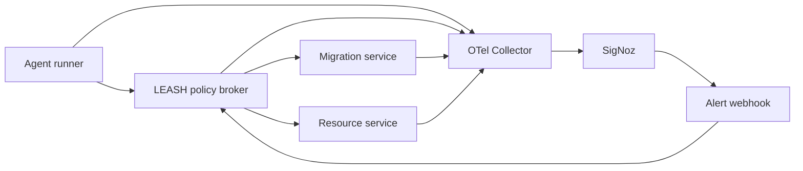

# LEASH — Autonomy Error Budget Gateway

> An AI agent earns destructive permissions from observed reliability — and loses them when SigNoz observes its downstream failures.

LEASH turns observability into an enforceable control input. Instead of asking why an agent failed after damage is done, the policy broker asks what the agent is still allowed to do before its next tool call.

## The control loop

1. `release-agent-01` starts at T3, where it may read, write, and perform a disposable destructive cleanup.
2. A downstream migration service is fault-injected and returns errors.
3. All four services emit traces, metrics, and logs through OpenTelemetry OTLP.
4. SigNoz evaluates the migration failure budget and sends a signed-style webhook payload to LEASH.
5. The policy broker records the evidence and demotes the agent to T1 (read-only).
6. The agent requests `delete_staging_table` and receives `403 AUTONOMY_TIER_DENIED`.



## Why this is a SigNoz project

SigNoz is not a dashboard added after the product. Its traces, metrics, logs, query-backed alert, and webhook are the evidence and actuator in LEASH's permission loop. A generic LLM wrapper cannot measure real downstream reliability or revoke a tool tier from it.

## Run locally

Prerequisites: Python 3.12+ and PowerShell. SigNoz is optional for local UI development; the demo includes an explicit “simulate SigNoz alert webhook” control so the broker can be verified without a running collector.

```powershell
Copy-Item .env.example .env
python -m venv .venv
.\.venv\Scripts\python.exe -m pip install -r requirements.txt
.\scripts\run-local.ps1 -BasePort 18000
```

Open [http://localhost:18000](http://localhost:18000). The light, paper-first control room drives the actual local broker endpoints; keyboard keys 1–4 run the on-stage sequence.

## Run the real SigNoz loop

In WSL, Foundry installs `foundryctl` in `$HOME/.local/bin`. Add it to the current shell before invoking it:

```bash
export PATH="$HOME/.local/bin:$PATH"
foundryctl --version
foundryctl cast -f casting.yaml
```

Foundry produces the required `casting.yaml.lock` after the deployment resolves. SigNoz then receives OTLP on port 4317 and serves its UI on port 8080. The exact dashboard panels, query, alert threshold, and webhook payload are in [docs/SIGNOZ_SETUP.md](docs/SIGNOZ_SETUP.md).

For WSL, use a working Linux Docker Engine and confirm it before casting:

```bash
docker ps
```

## Verify

```powershell
$env:PYTHONPATH = "."
.\.venv\Scripts\python.exe -m pytest -q
.\scripts\integration-check.ps1 -BasePort 18000
```

The integration check proves the happy path, three failed migrations, T1 demotion, 403 destructive denial, and policy reset.

## Repository guide

- [docs/LEASH_SPEC.md](docs/LEASH_SPEC.md) — product and technical specification
- [docs/ARCHITECTURE.md](docs/ARCHITECTURE.md) — system and telemetry contract
- [docs/SIGNOZ_SETUP.md](docs/SIGNOZ_SETUP.md) — SigNoz dashboard and alert configuration
- [docs/DEMO_SCRIPT.md](docs/DEMO_SCRIPT.md) — 150-second recording script
- [DESIGN.md](DESIGN.md) — paper-cockpit design contract

## Trust tiers

| Tier | Available tools |
| --- | --- |
| T3 | Read, write, and disposable destructive cleanup |
| T2 | Read and reversible write |
| T1 | Read-only |
| T0 | No tool execution |

## AI disclosure

AI assistance was used for implementation, testing, documentation, and visual design. This will be declared in the hackathon submission as required.
