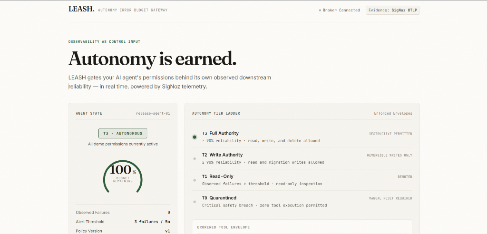
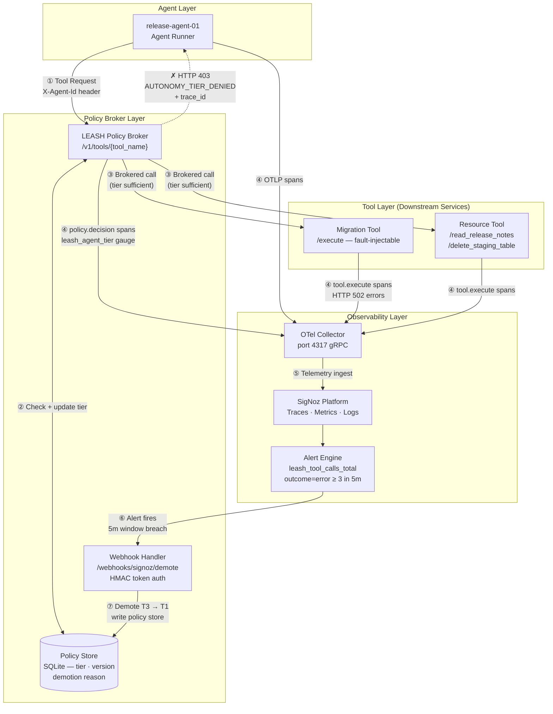
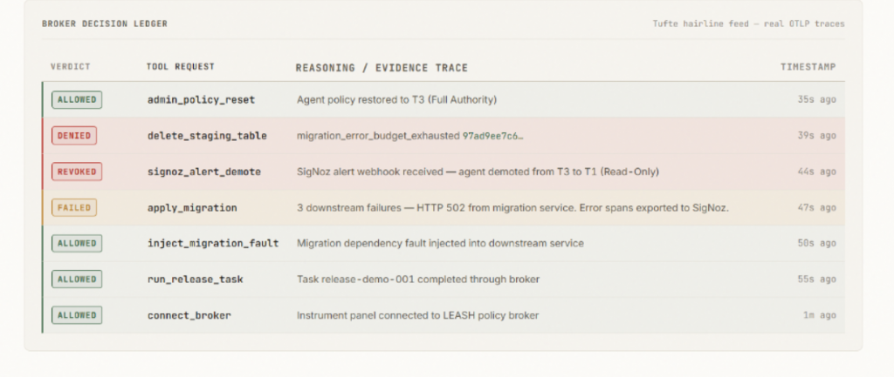

# LEASH — Autonomy is Earned.

> **A circuit breaker for dangerous AI agent tools.**  
> When SigNoz observes downstream failures, LEASH automatically downgrades the agent before its next destructive action.

*Trust is a metric, not a setting.*

---

<p align="center">
  
</p>

---

## 1. The Insight

> **"Human-in-the-loop is a lie at scale. At production velocity, no one reviews hundreds of agent actions per hour. The only supervision that scales is the one SREs invented decades ago: error budgets and automated policy enforcement. LEASH makes autonomy itself an observable, continuously evaluated metric."**

Most teams use observability to explain what an AI agent did *after* production is broken. LEASH turns observability into a load-bearing control plane input — it decides what the agent is allowed to do *while it's still running*.

**LEASH is not an AI safety policy written in English. It is an autonomy control loop enforced by telemetry.**

---

## 2. The 30-Second Demo

1. `release-agent-01` starts at **T3 (Full Authority)** — reads release notes, applies migrations.
2. Migration dependency fails (HTTP 502 injected); all services stream OTLP spans and metrics to SigNoz (`:4317`).
3. SigNoz evaluates: `sum(leash_tool_calls_total{tool_name="apply_migration", outcome="error"}) >= 3` over 5 minutes. Alert fires.
4. SigNoz POSTs to `/webhooks/signoz/demote` — agent drops from **T3 → T1 (Read-Only)** in under 10 seconds.
5. Agent attempts `delete_staging_table`. LEASH intercepts:

```json
HTTP/1.1 403 Forbidden

{
  "error": "AUTONOMY_TIER_DENIED",
  "agent_id": "release-agent-01",
  "current_tier": "T1",
  "required_tier": "T3",
  "reason": "migration_error_budget_exhausted",
  "trace_id": "de4b97f1896593b813ca4cac9e280584"
}
```

The agent is not blocked by a prompt rule. It is blocked by empirical reliability evidence recorded in SigNoz. Paste the `trace_id` into SigNoz to see the exact failure spans behind the decision.

---

## 3. Control Loop Architecture



---

## 4. Autonomy Trust Tiers

| Tier | Permissions | Reliability SLA |
| --- | --- | --- |
| **T3** Full Authority | Read, write, destructive cleanup (`delete_staging_table`) | ≥ 98% observed reliability |
| **T2** Write Authority | Read and reversible writes (`apply_migration`) | ≥ 90% observed reliability |
| **T1** Read-Only | Read-only inspection (`read_release_notes`) | Failure budget consumed |
| **T0** Quarantined | Zero tool execution permitted | Manual reset required |

---

## 5. Why This Is a SigNoz Project

SigNoz is not a dashboard added after the product. Its alerts and webhooks are the actuator that changes agent permissions in real time.

| Signal | Query / Endpoint | Role in LEASH |
| --- | --- | --- |
| **Distributed Trace** | `leash.policy.decision` & `leash.tool.execute` | Execution waterfall + trace ID evidence on every denial |
| **Gauge Metric** | `leash_agent_tier` | Real-time active autonomy tier |
| **Counter Metric** | `leash_tool_calls_total` | Tracks outcomes (`success` / `error`) and risk levels |
| **Counter Metric** | `leash_policy_decisions_total` | Counts `allow` vs `deny` decisions |
| **SigNoz Alert** | `outcome=error >= 3 in 5m` | Converts error budget breach into a control signal |
| **Webhook Actuator** | `POST /webhooks/signoz/demote` | SigNoz demotes agent tier — no human click required |

A prompt can ask an agent to "be careful." An LLM guardrail can filter words. Neither can evaluate a 5-minute sliding window error budget or revoke execution privileges before the next call. That requires live telemetry and SigNoz acting inside the permission loop.

---

## 6. Broker Decision Ledger

<p align="center">
  
</p>

<p align="center">
  <em>Every row is a real policy decision backed by OTLP telemetry. The DENIED row carries trace ID <code>97ad9ee7c6…</code> — verifiable in SigNoz.</em>
</p>

---

## 7. Tech Stack

| Layer | Technology | Role |
|---|---|---|
| **Agent Runtime** | Python 3.12 + FastAPI | `release-agent-01` makes tool calls through the broker via HTTP |
| **Policy Broker** | FastAPI + SQLite | Evaluates tier vs. tool requirement; issues HTTP 403 with trace evidence |
| **Tool Services** | FastAPI ×2 | `migration-tool` and `resource-tool` — fault-injectable downstream services |
| **Instrumentation** | OpenTelemetry Python SDK | Traces, metrics, and structured logs on every policy decision |
| **Telemetry Backend** | SigNoz (self-hosted) | Ingests OTLP on `:4317`; runs alert rules and webhook delivery |
| **Alert Transport** | SigNoz Webhook → HMAC-auth | Fires alert; broker demotes tier in < 10 s |
| **Fail Behavior** | Fail-open (by design) | If SigNoz is unreachable, agent retains its last known tier |
| **Deployment (local)** | Foundry (`casting.yaml`) | `casting.yaml.lock` committed — fully reproducible for judges |
| **Deployment (cloud)** | Vercel Serverless Python | Live at [leash-beta.vercel.app](https://leash-beta.vercel.app) |
| **Test Suite** | pytest (20 tests) | Happy path, fault injection, demotion, 403 denial, admin reset |

---

## 8. Quick Start

### SigNoz (Foundry — Linux / WSL 2)

```bash
foundryctl cast -f casting.yaml
```

> `casting.yaml.lock` is committed. Judges can reproduce the exact SigNoz environment used during development.

### LEASH Services

**Linux / WSL 2:**
```bash
cp .env.example .env && python3 -m venv .venv && source .venv/bin/activate
pip install -r requirements.txt && python3 scripts/serve.py
```

**Windows PowerShell:**
```powershell
Copy-Item .env.example .env
python -m venv .venv && .\.venv\Scripts\python.exe -m pip install -r requirements.txt
.\scripts\run-local.ps1 -BasePort 18000
```

Open [http://localhost:18000](http://localhost:18000) or [leash-beta.vercel.app](https://leash-beta.vercel.app). Keys `1–4` run the full demo sequence.

---

## 9. Tests

```bash
python3 -m pytest -v
```

20/20 passing. Covers: T3 happy path, fault injection, webhook demotion (T3 → T1), HTTP 403 denial, admin reset.

---

## 10. Repository

- [docs/SIGNOZ_SETUP.md](docs/SIGNOZ_SETUP.md) — SigNoz alert rule, dashboard panels, webhook config
- [docs/ARCHITECTURE.md](docs/ARCHITECTURE.md) — System architecture and telemetry contracts
- [docs/DEMO_SCRIPT.md](docs/DEMO_SCRIPT.md) — Video demo presenter script
- [docs/LEASH_SPEC.md](docs/LEASH_SPEC.md) — Full technical specification

---

## Track & Submission

**Track 1: AI & Agent Observability** · Agents of SigNoz Hackathon  
**Core Thesis**: Autonomy is an error budget.

AI assistance was used for implementation, testing, and documentation. Declared per hackathon rules.
