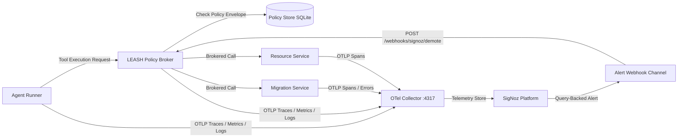

# LEASH — Autonomy is Earned.

> **A circuit breaker for dangerous AI agent tools.**  
> When SigNoz observes downstream failures, LEASH automatically downgrades the agent before its next destructive action.

---

## The Uncomfortable Insight

> **"Human-in-the-loop is a lie at scale; autonomy must be an error budget, not a static prompt setting."**

Most teams use observability to explain what an AI agent did *after* production is broken:
> *"Why did `release-agent-01` drop the staging database?"*

LEASH turns observability into a load-bearing control input. It asks a more critical question *before* the next tool call:
> *"Based on what SigNoz just observed in real-time telemetry, is this AI agent still allowed to perform a destructive operation?"*

**LEASH is not an AI safety policy written in English. It is an autonomy control loop enforced by telemetry.**

---

## The Demo in 30 Seconds

1. **Trusted Start**: `release-agent-01` begins at **Tier T3 (Full Authority)**.
2. **Healthy Execution**: It reads release notes and applies a schema migration via the LEASH policy broker.
3. **Downstream Failure**: A downstream migration dependency fails and returns errors.
4. **OTLP Telemetry Flow**: All four microservices emit OpenTelemetry spans, metrics, and logs directly to SigNoz.
5. **SigNoz Failure-Budget Alert**: SigNoz evaluates a 5-minute error budget query (`leash_tool_calls_total{tool_name="apply_migration", outcome="error"}`) and fires an alert.
6. **Automatic Demotion**: SigNoz POSTs an alert webhook to the LEASH broker, instantly demoting the agent from **T3 → T1 (Read-Only)**.
7. **Destructive Tool Attempt**: The agent attempts `delete_staging_table` (requires T3).
8. **The Arrest**: LEASH intercepts the call and returns **`HTTP 403 AUTONOMY_TIER_DENIED`**, citing the exact SigNoz trace ID as evidence.

---

## The Moment of Arrest (`403 AUTONOMY_TIER_DENIED`)

When the demoted agent attempts a destructive action, LEASH returns a hard policy denial carrying trace-based proof:

```json
HTTP/1.1 403 Forbidden
{
  "error": "AUTONOMY_TIER_DENIED",
  "agent_id": "release-agent-01",
  "current_tier": "T1",
  "required_tier": "T3",
  "reason": "migration_error_budget_exhausted",
  "trace_id": "de4b97f1896593b813ca4cac9e280584"
}
```

This ensures full auditability: the agent is not blocked by a prompt constraint, but by empirical reliability evidence recorded in SigNoz.

---

## Control Loop Architecture



---

## Autonomy Trust Tiers

| Tier | Name | Permissions & Envelope | Reliability SLA |
| --- | --- | --- | --- |
| **T3** | Full Authority | Read, write, and disposable destructive cleanup (`delete_staging_table`) | ≥ 98% observed reliability |
| **T2** | Write Authority | Read and reversible writes (`apply_migration`) | ≥ 90% observed reliability |
| **T1** | Read-Only | Read-only inspection (`read_release_notes`) | Failure budget consumed / Demoted |
| **T0** | Quarantined | Zero tool execution permitted | Safety breach / Manual reset required |

---

## Why this is a SigNoz Project

SigNoz is not a dashboard added after the product. Its traces, metrics, logs, query-backed alert, and webhook are the evidence and actuator in LEASH's permission loop.

### What SigNoz Actually Observes

| Signal | Example / Query | Why it matters |
| --- | --- | --- |
| **Trace** | `leash.policy.decision` & `leash.tool.execute` | Full decision path and trace ID context before/after demotion |
| **Metric** | `leash_agent_tier` | Real-time gauge of enforced autonomy tier ($3 = \text{T3}, 1 = \text{T1}$) |
| **Metric** | `leash_tool_calls_total` | Tracks tool outcomes (`success` vs `error`) and risk levels (`read`, `write`, `destructive`) |
| **Metric** | `leash_policy_decisions_total` | Counts policy decisions (`allow` vs `deny`) |
| **Log** | `policy_decision deny` | Structured OTLP log containing trace ID and reason |
| **Alert** | `sum(leash_tool_calls_total{tool_name="apply_migration", outcome="error"}) >= 3` | Converts 5-minute error budget breach into a control signal |
| **Webhook** | `POST http://<HOST_GATEWAY>:18001/webhooks/signoz/demote` | Actuates policy demotion directly from SigNoz |

---

## Why a Generic LLM Wrapper Cannot Do This

A prompt can ask an agent to "be careful." An LLM guardrail can filter words in a prompt.

**Neither can measure real downstream service behavior.**

A generic LLM wrapper cannot:
- Track downstream database dependency error rates across tool calls,
- Correlate agent actions with backend microservice HTTP 502 error spans,
- Evaluate a 5-minute sliding window error budget,
- Fire a query-backed alert from live telemetry,
- Or dynamically restrict tool execution privileges before the next action.

That requires OpenTelemetry signals and SigNoz acting directly inside the permission control loop.

---

## Quick Start & Reproducibility

### 1. Run the SigNoz Stack (Foundry / Docker)

SigNoz runs self-hosted via **Foundry** (listening on OTLP gRPC port `4317` and Web UI on port `8080`).

```bash
# Install foundryctl (Linux / WSL 2)
export PATH="$HOME/.local/bin:$PATH"
foundryctl cast -f casting.yaml
```
> This produces the mandatory `casting.yaml.lock` file proving reproducible deployment.

### 2. Run LEASH Microservices

#### Linux / WSL:
```bash
cp .env.example .env
python3 -m venv .venv
source .venv/bin/activate
pip install -r requirements.txt
python3 scripts/serve.py
```

#### Windows PowerShell:
```powershell
Copy-Item .env.example .env
python -m venv .venv
.\.venv\Scripts\python.exe -m pip install -r requirements.txt
.\scripts\run-local.ps1 -BasePort 18000
```

Open [http://localhost:18000](http://localhost:18000) to access the LEASH Control Room UI. Keyboard keys `1–4` execute the live demo sequence.

> **Note on Demo Fallback**: The full live loop runs via SigNoz alerts. A "Simulate SigNoz alert webhook" button exists in the control room solely as a live-demo network fallback.

---

## Verification & Test Suite

Run unit and integration checks:

```bash
# Run pytest suite
python3 -m pytest -q

# Run automated integration check
./scripts/integration-check.ps1 -BasePort 18000
```

The test suite validates:
- T3 happy path release execution,
- Migration fault injection and error span generation,
- SigNoz demote webhook authentication token (`X-LEASH-WEBHOOK-TOKEN`) & tier demotion (T3 → T1),
- Hard `403 AUTONOMY_TIER_DENIED` on destructive tool calls at T1,
- Admin policy reset back to T3.

---

## Repository Guide

- [docs/LEASH_SPEC.md](docs/LEASH_SPEC.md) — Product and technical specification
- [docs/ARCHITECTURE.md](docs/ARCHITECTURE.md) — System and telemetry contract
- [docs/SIGNOZ_SETUP.md](docs/SIGNOZ_SETUP.md) — SigNoz dashboard, metric panels, and alert configuration
- [docs/DEMO_SCRIPT.md](docs/DEMO_SCRIPT.md) — 150-second recording script
- [DESIGN.md](DESIGN.md) — Instrument panel design system

---

## Track & Category

- **Track 1: AI & Agent Observability**
- **Core Thesis**: *Autonomy is an error budget.*

---

## AI Disclosure

AI assistance was used for implementation, testing, documentation, and visual design. Declared in accordance with hackathon guidelines.
