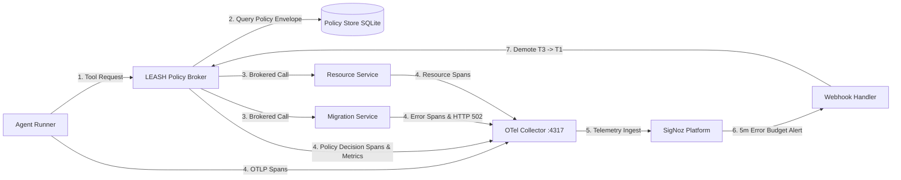

# LEASH — Autonomy is Earned.

> **A circuit breaker for dangerous AI agent tools.**  
> When SigNoz observes downstream failures, LEASH automatically downgrades the agent before its next destructive action.

**Tagline**: *Trust is a metric, not a setting.*

---

<p align="center">
  
</p>

<p align="center">
  <em>Figure 1: The Arrest — The moment SigNoz detects downstream error budget depletion, fires a webhook, demotes the agent to T1 Read-Only, and intercepts destructive tool calls with HTTP 403.</em>
</p>

---

## 1. The Uncomfortable Insight

> **"Human-in-the-loop is a lie at scale. At production velocity, no one reviews hundreds of agent actions per hour. The only supervision that scales is the one SREs invented decades ago: error budgets and automated policy enforcement. LEASH makes autonomy itself an observable, continuously evaluated metric."**

Most teams use observability to explain what an AI agent did *after* production is broken:
> *"Why did `release-agent-01` drop the staging database at 3:00 AM?"*

LEASH turns observability into a load-bearing control plane input. It asks a more critical question *before* the next tool call:
> *"Based on what SigNoz just observed in real-time OpenTelemetry data, is this AI agent still allowed to perform a destructive operation?"*

**LEASH is not an AI safety policy written in English. It is an autonomy control loop enforced by telemetry.**

---

## 2. What LEASH Actually Does (The 30-Second Story)

1. **Trusted Start**: `release-agent-01` begins at **Tier T3 (Full Authority)**.
2. **Healthy Execution**: The agent reads release notes and applies a schema migration via the LEASH policy broker.
3. **Downstream Failure**: A downstream migration dependency is fault-injected and starts returning HTTP 502 errors.
4. **OTLP Telemetry Flow**: All four microservices emit OpenTelemetry spans, metrics, and logs directly to the SigNoz collector on port `:4317`.
5. **SigNoz Failure-Budget Alert**: SigNoz evaluates a 5-minute error budget query (`sum(leash_tool_calls_total{tool_name="apply_migration", outcome="error"}) >= 3`) and fires an alert.
6. **Automatic Demotion**: SigNoz POSTs an alert webhook to the LEASH broker (`/webhooks/signoz/demote`), instantly demoting the agent from **T3 → T1 (Read-Only)**.
7. **Destructive Tool Attempt**: The demoted agent attempts `delete_staging_table` (requires T3 authority).
8. **The Arrest**: LEASH intercepts the call and returns a hard policy denial containing exact trace-based proof:

```json
HTTP/1.1 403 Forbidden
Content-Type: application/json

{
  "error": "AUTONOMY_TIER_DENIED",
  "agent_id": "release-agent-01",
  "current_tier": "T1",
  "required_tier": "T3",
  "reason": "migration_error_budget_exhausted",
  "trace_id": "de4b97f1896593b813ca4cac9e280584"
}
```

This ensures complete auditability: the agent is not blocked by a prompt rule or LLM opinion, but by empirical reliability evidence recorded in SigNoz.

---

## 3. Name & Meaning

LEASH is pronounced **"leesh"** (rhymes with *teach*).

A leash is not a cage — it is controlled freedom. An autonomous agent may act, but only within the trust boundary its own telemetry has earned. When SigNoz observes downstream failures, the leash tightens automatically.

**Backronym**: *Live Evidence-based Autonomy Safety Harness*

---

## 4. Control Loop Architecture



The system operates as a closed-loop governor: tool requests pass through `leash-broker`, microservices emit OpenTelemetry data to SigNoz, and SigNoz acts as the external sensor that fires policy demotion events back to the broker.

---

## 5. Autonomy Trust Tiers

| Tier | Name | Permissions & Envelope | Reliability SLA |
| --- | --- | --- | --- |
| **T3** | Full Authority | Read, write, and disposable destructive cleanup (`delete_staging_table`) | ≥ 98% observed reliability |
| **T2** | Write Authority | Read and reversible writes (`apply_migration`) | ≥ 90% observed reliability |
| **T1** | Read-Only | Read-only inspection (`read_release_notes`) | Failure budget consumed / Demoted |
| **T0** | Quarantined | Zero tool execution permitted | Safety breach / Manual reset required |

---

## 6. Why This Is a SigNoz Project

SigNoz is not a dashboard added after the product. Its traces, metrics, logs, query-backed alerts, and MCP integration are the evidence and actuator in LEASH's permission control loop.

### What SigNoz Actually Observes

| Signal | Example / Query | Why it matters |
| --- | --- | --- |
| **Distributed Trace** | `leash.policy.decision` & `leash.tool.execute` | Full execution waterfall and trace ID context before/after demotion |
| **Gauge Metric** | `leash_agent_tier` | Real-time gauge of active autonomy tier ($3 = \text{T3}, 1 = \text{T1}$) |
| **Counter Metric** | `leash_tool_calls_total` | Tracks tool outcomes (`success` vs `error`) and risk levels (`read`, `write`, `destructive`) |
| **Counter Metric** | `leash_policy_decisions_total` | Counts policy decisions (`allow` vs `deny`) across agent runs |
| **OTLP Structured Log** | `policy_decision deny` | Emits structured log payload carrying trace ID and failure reason |
| **SigNoz Alert** | `sum(leash_tool_calls_total{tool_name="apply_migration", outcome="error"}) >= 3` | Converts 5-minute sliding window error budget breach into a control signal |
| **Webhook Actuator** | `POST http://<HOST_GATEWAY>:18001/webhooks/signoz/demote` | Actuates policy demotion directly from SigNoz alert engine |
| **SigNoz MCP** | `signoz-mcp-server` integration | Enables coding agents to query live trace evidence during incident triage |

### Why a Generic LLM Wrapper Cannot Do This

A prompt can ask an agent to "be careful." An LLM guardrail can filter words in a prompt. **Neither can measure real downstream service behavior.**

A generic LLM wrapper cannot:
- Track downstream microservice HTTP 502 error rates across tool calls,
- Correlate agent actions with backend database failure spans,
- Evaluate a 5-minute sliding window error budget,
- Fire a query-backed alert from live telemetry,
- Or dynamically revoke tool execution privileges before the next action.

That requires OpenTelemetry signals and SigNoz acting directly inside the permission control loop.

---

## 7. The Control Room UI (Instrument Panel Aesthetic)

The LEASH Control Room is built around a **flight instrument panel printed on fine paper** design language (`DESIGN.md`):

<p align="center">
  
</p>

- **Typography**: Fraunces for editorial headlines, Inter for crisp UI controls, and JetBrains Mono for telemetry metadata.
- **Color Palette**: Warm paper background (`#FBF9F5`), iron ink text (`#1A1917`), and muted signal accents (brass, cinnabar, sage).
- **Error Budget Gauge**: A 270-degree SVG dial reflecting real-time budget state ($100\% \rightarrow 0\%$).
- **Restrained Motion**: On policy denial, the interface applies a precise 120ms horizontal micro-shake and drops an inline crimson alert banner carrying monospace trace evidence.

---

## 8. Quick Start & Reproducibility

### 1. Run the SigNoz Stack (Foundry Deployment)

SigNoz is deployed via **Foundry** (listening on OTLP gRPC port `4317` and Web UI on port `8080`).

```bash
# Install foundryctl (Linux / WSL 2)
export PATH="$HOME/.local/bin:$PATH"

# Cast SigNoz deployment specification
foundryctl cast -f casting.yaml
```

> **Judges**: The repository includes the committed `casting.yaml.lock` file. Running `foundryctl cast -f casting.yaml` reproduces the exact SigNoz environment used during development.

### 2. Run LEASH Microservices

#### Linux / WSL 2:
```bash
cp .env.example .env
python3 -m venv .venv
source .venv/bin/activate
pip install -r requirements.txt
python3 scripts/serve.py
```

#### Windows PowerShell:
```powershell
Copy-Item .env.example .env
python -m venv .venv
.\.venv\Scripts\python.exe -m pip install -r requirements.txt
.\scripts\run-local.ps1 -BasePort 18000
```

Open [http://localhost:18000](http://localhost:18000) (or live at [https://leash-beta.vercel.app](https://leash-beta.vercel.app)) to access the Control Room UI. Keyboard keys `1–4` execute the live demo sequence.

---

## 9. Verification & Automated Test Suite

Run the full unit and contract test suite:

```bash
# Run pytest suite (20/20 test cases)
python3 -m pytest -v

# Run automated integration script
./scripts/integration-check.ps1 -BasePort 18000
```

The test suite validates:
- T3 happy path release execution,
- Migration fault injection and HTTP 502 error span generation,
- SigNoz demote webhook authentication token (`X-LEASH-WEBHOOK-TOKEN`) and tier demotion (T3 → T1),
- Hard `HTTP 403 AUTONOMY_TIER_DENIED` on destructive tool calls at T1,
- Admin policy reset back to T3.

---

## 10. Repository Guide

- [docs/LEASH_SPEC.md](docs/LEASH_SPEC.md) — Product and technical specification
- [docs/ARCHITECTURE.md](docs/ARCHITECTURE.md) — System architecture and telemetry contracts
- [docs/SIGNOZ_SETUP.md](docs/SIGNOZ_SETUP.md) — SigNoz dashboard, metric panels, and alert configuration
- [docs/DEMO_SCRIPT.md](docs/DEMO_SCRIPT.md) — 150-second video demo presenter script
- [DESIGN.md](DESIGN.md) — Instrument panel design system

---

## 11. Demo Video & Article

- **Video Demo**: [Watch the 3-Minute Video Demo on YouTube](https://youtube.com)
- **Technical Article**: [Read the Full Technical Write-up on Dev.to](https://dev.to)

---

## 12. Track & Hackathon Submission

- **Hackathon**: Agents of SigNoz
- **Track**: Track 1: AI & Agent Observability
- **Core Thesis**: *Autonomy is an Error Budget.*

---

## 13. AI Disclosure

AI assistance was used for implementation, testing, documentation, and visual design. Declared in accordance with hackathon submission guidelines.
