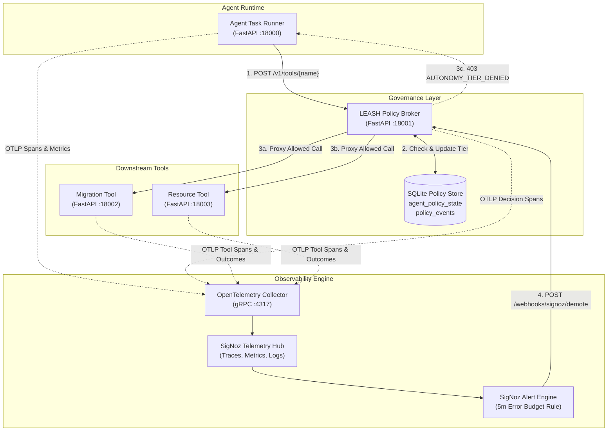

# LEASH System Architecture

## Overview

LEASH (**L**egible **E**nforcement of **A**gent **S**afety **H**ierarchies) implements an SRE-inspired **error budget gateway** for autonomous AI agents.

Rather than relying on static IAM roles, system prompt guardrails, or post-hoc log analysis, LEASH uses **OpenTelemetry** and **SigNoz** as a **synchronous feedback control loop**:

$$\text{Downstream Execution} \xrightarrow{\text{OTLP}} \text{SigNoz Aggregation} \xrightarrow{\text{Alert Rule}} \text{Webhook Demotion} \xrightarrow{\text{Policy Store}} \text{HTTP 403 Denial}$$



---

## Trust Tier Matrix

LEASH defines four discrete autonomy tiers. An agent begins with the highest tier allowed for its domain and is demoted as downstream failures exhaust its error budget.

| Tier | Tier Name | Allowed Actions | Risk Profile |
|---|---|---|---|
| **T3** | `T3` Full Authority | Read release notes, Apply migration, Delete staging table | Destructive & Reversible |
| **T2** | `T2` Write Authority | Read release notes, Apply migration | Reversible Writes Only |
| **T1** | `T1` Read-Only | Read release notes | Non-mutating Reads Only |
| **T0** | `T0` Quarantined | None | Quarantined / Demoted |

---

## Service Inventory

| Service | Port | Responsibilities | Key Endpoints |
|---|---|---|---|
| `agent-runner` | `18000` | Simulates agent task workflows, renders control UI | `GET /`, `POST /api/demo/*` |
| `leash-broker` | `18001` | Enforces policy state, proxies tool calls, handles demotion webhooks | `POST /v1/tools/{name}`, `POST /webhooks/signoz/demote`, `GET /v1/agents/{id}/events` |
| `migration-tool` | `18002` | Downstream write service with injectable fault flag | `POST /execute`, `POST /demo/failure` |
| `resource-tool` | `18003` | Downstream read & destructive service | `POST /read_release_notes`, `POST /delete_staging_table` |

---

## Telemetry Contract

Every service instruments HTTP requests, FastAPI endpoints, and internal domain spans using official OpenTelemetry SDKs:

### Resource Attributes
- `service.name`: `agent-runner`, `leash-broker`, `migration-tool`, `resource-tool`
- `service.version`: `0.1.0`
- `deployment.environment.name`: `demo`

### Spans & Namespace Attributes
- `leash.agent.id`: Unique identifier of the agent (`release-agent-01`)
- `leash.task.id`: Task execution ID (`release-demo-001`)
- `leash.tool.name`: Target tool requested (`apply_migration`, `delete_staging_table`)
- `leash.tool.risk`: Risk level (`read`, `write`, `destructive`)
- `leash.tool.outcome`: Outcome reported by downstream tool (`success`, `error`)
- `leash.current_tier`: Enforced tier at decision time (`T3`, `T1`)
- `leash.required_tier`: Required tier for tool execution
- `leash.decision`: Policy decision (`allow`, `deny`)

### Custom Metrics
- `leash_tool_calls_total`: Counter by tool, risk, and outcome
- `leash_policy_decisions_total`: Counter by decision (`allow`/`deny`), current tier, required tier
- `leash_agent_tier`: Observable gauge emitting current numeric tier ($0 \dots 3$)
- `leash_alert_webhooks_total`: Counter by webhook outcome (`success`, `unauthorized`, `invalid_promotion`)

---

## Data & Persistence Schema

Policy state and event logs are stored in a local, fast SQLite database (`/data/leash.db`).

```sql
CREATE TABLE IF NOT EXISTS agent_policy_state (
  agent_id TEXT PRIMARY KEY,
  current_tier INTEGER NOT NULL,
  policy_version INTEGER NOT NULL DEFAULT 1,
  last_demoted_at TEXT,
  last_alert_id TEXT,
  last_demote_reason TEXT
);

CREATE TABLE IF NOT EXISTS policy_events (
  id INTEGER PRIMARY KEY AUTOINCREMENT,
  agent_id TEXT NOT NULL,
  event_type TEXT NOT NULL,
  from_tier INTEGER,
  to_tier INTEGER,
  alert_id TEXT,
  reason TEXT,
  created_at TEXT NOT NULL
);
```

---

## Security & Demotion Guarantees

1. **Idempotent Webhooks:** Alert retries with the same `alert_id` are idempotent and do not increment `policy_version` or obscure original evidence.
2. **Monotonic Demotion:** Demotion webhooks can **only reduce** an agent's authority. Any payload attempting to raise the tier via webhook returns `HTTP 400 Bad Request`.
3. **Token Isolation:** Webhooks require `X-LEASH-WEBHOOK-TOKEN`. Administrative resets require `X-ADMIN-TOKEN`.
4. **Deterministic Enforcement:** Policy evaluation uses deterministic SQLite locks. It does not depend on LLM inference latencies or availability.
