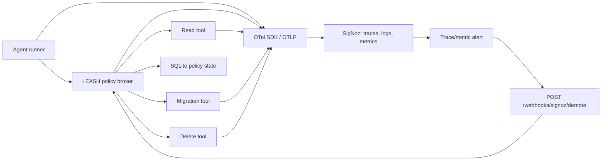

# LEASH: Autonomy Error Budget Gateway

**Hackathon track:** Track 01 - AI & Agent Observability
**Build window:** 24 hours, solo
**Status:** Build specification - source of truth
**Submission promise:** An agent does not keep destructive permissions merely because it was granted them once. It must continuously earn them from observed reliability.

## 1. One-line concept

LEASH is an OpenTelemetry-instrumented policy broker that automatically demotes an AI agent's permissions after SigNoz observes its downstream tool failures burning through an autonomy error budget.

The live proof is simple: an agent starts able to read, write, and delete; a poisoned migration tool begins failing; SigNoz traces and dashboard show the evidence; a real SigNoz alert sends a webhook; the broker demotes the agent; its next destructive request is denied.

## 2. Why this should exist

Today, most agent observability products answer the question after damage is done: **why did the agent fail?** LEASH answers the operational question before the next damaging action: **what is this agent still allowed to do?**

The project applies a familiar SRE idea - error budgets - to agent autonomy. A service that misses its reliability objective loses release velocity. An agent that repeatedly fails downstream tool calls loses destructive authority.

This is not an AI safety chatbot, a token dashboard, or an SRE copilot. SigNoz is a load-bearing control input:

1. It receives the independent runtime evidence.
2. It aggregates the evidence across requests and tools.
3. It fires the condition that changes policy state.
4. It shows the judge the trace-level reason for the denial.

If SigNoz disappears, LEASH cannot calculate or prove the agent's observed reliability, and the core product collapses.

## 3. Non-negotiable product rules

1. **No fake telemetry.** Every dashboard panel, trace, alert, and webhook state change in the demo must come from the running services.
2. **No LLM is needed to make the core point.** The first release may use a deterministic task planner. An optional LLM planner can be added only after the reliability loop works.
3. **Downstream results are the evidence.** The agent cannot mark its own tool call successful. The invoked service determines `tool.outcome`.
4. **The broker is the enforcement point.** A dashboard alone cannot prevent harm. The broker must reject a forbidden action with HTTP 403.
5. **No real destructive infrastructure.** `delete_staging_table` mutates a disposable SQLite record or local mock resource only.
6. **No sensitive data in telemetry.** Use generated task IDs and agent IDs. Never send prompts containing secrets, customer data, or source code.
7. **Alert-driven demotion must be visible.** Do not claim instant intervention. State the configured alert evaluation interval and demonstrate that the next action after alert delivery is restricted.

## 4. User and Tuesday moment

**Primary user:** Maya, a solo founder who allows a deployment agent to make controlled changes while she sleeps.

**Tuesday, 02:47:** the agent attempts a schema migration. The downstream migration endpoint starts returning errors after a simulated dependency fault. Existing agent systems would keep retrying and may escalate to cleanup commands. In LEASH, the failures create real OpenTelemetry spans. SigNoz detects that the Tier 2 write-tool error budget is exhausted and calls the broker's demotion webhook. When the agent next asks to delete a staging table, the broker returns a denial with the current tier and a trace ID that explains the decision.

## 5. Scope

### In scope

- A deterministic agent task runner.
- A policy broker that gates three risk tiers.
- Three downstream HTTP tools with truthful outcomes.
- OpenTelemetry traces, logs, and custom metrics exported by OTLP.
- A self-hosted SigNoz deployment via Foundry.
- SigNoz dashboard, trace explorer workflow, and at least one alert webhook.
- A reproducible `casting.yaml` and `casting.yaml.lock`.
- A polished but restrained demo control page.

### Explicitly out of scope

- Production authorization, IAM integration, Kubernetes execution, cloud credentials, database migration engines, or real deletion.
- Claims of AI safety certification, compliance certification, or instantaneous real-world intervention.
- Fake MCP execution consoles, fake SQL output, or simulated SigNoz panels.
- A full generic agent framework SDK.

## 6. Product journey

### Screen 1: Control room

The default view contains only the information needed to understand the system:

- Current agent autonomy tier: `T3 - destructive permitted`.
- Current error budget status: `Healthy`.
- Three permission chips: Read, Write, Delete.
- A primary action: `Run release task`.
- A secondary, clearly dangerous test action: `Inject migration failure`.
- A compact event timeline with live broker decisions.

The visual scene is a founder's quiet night-time control room, not a generic cyberpunk dashboard. Use a near-black, restrained surface; cyan is reserved for observed telemetry; amber for degraded trust; red only for failures and denials. Respect `prefers-reduced-motion`.

### Screen 2: Failure accumulation

After failure injection, the task runner makes multiple instrumented migration attempts. The local control page shows each outcome as it returns, but makes no policy claim until the alert is received.

The presenter opens SigNoz beside the page. The audience sees:

- The `leash.tool.execute` spans with `tool.outcome=error`.
- A rising failed-tool-call series on the LEASH dashboard.
- The alert state changing to firing.

### Screen 3: Demotion and denial

The alert webhook calls the broker. The control page changes from `T3` to `T1 - read only`, preserving the event timestamp and alert ID. The runner then attempts `delete_staging_table`; the broker returns 403 and records a `leash.policy.decision` span with `decision=deny`.

The final message is not a generic error:

> Delete denied. Agent tier T1 does not permit destructive actions. Demoted after observed downstream migration failures. Inspect trace `<trace_id>`.

### Screen 4: Evidence view

The demo moves back to SigNoz and opens the denied action trace. The parent trace contains:

- broker authorization decision;
- attempted tool request;
- returned 403;
- current agent tier;
- error budget state;
- correlation to the alert/demotion event through `leash.policy_version` and `leash.demoted_at`.

## 7. Architecture



### Services

| Service | Responsibility | Must emit |
|---|---|---|
| `agent-runner` | Runs the deterministic release task and requests tools through broker | root task trace, task logs, agent metadata |
| `leash-broker` | Authorizes, proxies, denies, receives alert webhook, persists tier | policy-decision spans, decision metrics, structured logs |
| `migration-tool` | Simulated write tool; failure can be injected | tool execution spans, truthful outcome |
| `resource-tool` | Mock read/delete operations against disposable state | tool execution spans, truthful outcome |
| `signoz` | Stores and queries OTLP telemetry | dashboard, alert, trace explorer |

### Trust tiers

| Tier | Granted tools | Meaning |
|---|---|---|
| `T0` | none | quarantined; manual reset required |
| `T1` | read | agent can inspect but not change anything |
| `T2` | read, write | agent can attempt reversible changes |
| `T3` | read, write, destructive | agent has earned full demo authority |

The demo begins at `T3`. The alert demotes directly to `T1`, making the effect unambiguous. A later release may support graduated recovery; do not build recovery automation in the hackathon MVP.

## 8. Functional requirements

### FR-1: Tool requests are brokered

All tool calls must pass through `POST /v1/tools/{tool_name}` on `leash-broker`. Direct calls to tool services are not exposed to the agent runner.

### FR-2: Broker authorizes by tier

The broker loads the current tier from SQLite, maps tool name to required tier, and either proxies the call or returns 403. It must emit a policy decision span for both outcomes.

### FR-3: Downstream tool failures are observable

The migration service has an environment-backed or endpoint-backed failure flag. When enabled, it returns HTTP 502 with a structured error. It never falsely returns success.

### FR-4: SigNoz alert demotes agent

A SigNoz trace- or metric-based alert detects failed migration calls above threshold in the configured window and sends a webhook to `POST /webhooks/signoz/demote`.

Webhook payload validation is deliberately simple but real: require a pre-shared `LEASH_WEBHOOK_TOKEN` header. The broker records alert ID, reason, timestamp, and target tier.

### FR-5: Denial is auditable

After demotion, a destructive call returns:

```json
{
  "error": "AUTONOMY_TIER_DENIED",
  "agent_id": "release-agent-01",
  "current_tier": "T1",
  "required_tier": "T3",
  "reason": "Observed migration failures exhausted the Tier 2 error budget",
  "trace_id": "<current trace id>"
}
```

### FR-6: Reset is manual

`POST /v1/admin/reset` restores `T3` only when a demo-only `X-Admin-Token` is present. This endpoint exists solely to replay the demo and must be labeled as such.

## 9. Telemetry contract

Use standard OpenTelemetry HTTP and service attributes wherever available. LEASH-specific attributes use the `leash.*` namespace.

### Resource attributes

```text
service.name = agent-runner | leash-broker | migration-tool | resource-tool
service.version = git SHA or dev
deployment.environment.name = demo
```

### Trace spans

| Span name | Emitted by | Required attributes |
|---|---|---|
| `leash.agent.task` | agent-runner | `leash.agent.id`, `leash.task.id`, `leash.task.type` |
| `leash.policy.decision` | broker | `leash.agent.id`, `leash.tool.name`, `leash.required_tier`, `leash.current_tier`, `leash.decision`, `leash.policy_version` |
| `leash.tool.execute` | tool service | `leash.agent.id`, `leash.tool.name`, `leash.tool.risk`, `leash.tool.outcome`, `http.response.status_code` |
| `leash.autonomy.demote` | broker webhook | `leash.agent.id`, `leash.from_tier`, `leash.to_tier`, `leash.alert.id`, `leash.demote.reason` |

### Metric contract

```text
leash_tool_calls_total{tool_name, tool_risk, outcome}
leash_policy_decisions_total{decision, current_tier, required_tier}
leash_agent_tier{agent_id}  # demo contains one agent only
leash_alert_webhooks_total{outcome}
```

Do not place raw prompts, tokens, database content, user records, or arbitrary task text in attributes. `agent_id` and `task_id` are synthetic demo identifiers.

### Structured log fields

```json
{
  "event": "policy_decision",
  "agent_id": "release-agent-01",
  "tool_name": "delete_staging_table",
  "decision": "deny",
  "current_tier": "T1",
  "required_tier": "T3",
  "trace_id": "..."
}
```

## 10. SigNoz configuration

### Dashboard: `LEASH - Autonomy Is Earned`

Build these panels in this order:

1. **Current autonomy tier** - latest `leash_agent_tier` value.
2. **Autonomy error budget** - failed migration tool calls / total migration tool calls, last 15 minutes.
3. **Tool calls by outcome and risk** - grouped bar or time series.
4. **Denied dangerous actions** - count of `leash.policy.decision` where `decision=deny` and `required_tier=T3`.
5. **Alert webhook delivery** - count and outcome of webhook calls.
6. **Trace table** - filtered `leash.agent.task` traces, grouped by `leash.task.id`, with duration and error status.

Every panel must allow drill-through into a trace or log. Avoid decorative panels that cannot answer a demo question.

### Alert: `LEASH - migration reliability breached`

MVP alert condition:

```text
In the last 5 minutes, count(leash.tool.execute where
  leash.tool.name = "apply_migration" AND
  leash.tool.outcome = "error") >= 3
```

Alert action:

```text
POST http://leash-broker:8001/webhooks/signoz/demote
Header: X-LEASH-WEBHOOK-TOKEN: ${LEASH_WEBHOOK_TOKEN}
Target tier: T1
Reason: migration_error_budget_exhausted
```

Use the real SigNoz alert UI or documented alert API to create it. Capture the final configuration in the README, not as a screenshot only.

### MCP use

MCP is optional to the runtime control loop. If enabled, use it after the alert to ask one bounded operational question:

> "Show the failed migration traces and the denied destructive action for release-agent-01 in the last 15 minutes."

Do not route live authorization through MCP. The broker remains deterministic and available if the MCP server is unavailable.

## 11. API contracts

### Request a tool action

```http
POST /v1/tools/apply_migration
X-Agent-Id: release-agent-01
Content-Type: application/json

{"task_id":"release-2026-07-25-01"}
```

### Inject failure

```http
POST /v1/demo/migration/failure
Content-Type: application/json

{"enabled":true}
```

### Demote from SigNoz alert

```http
POST /webhooks/signoz/demote
X-LEASH-WEBHOOK-TOKEN: <secret>
Content-Type: application/json

{
  "alert_id":"signoz-alert-id",
  "agent_id":"release-agent-01",
  "target_tier":"T1",
  "reason":"migration_error_budget_exhausted"
}
```

## 12. Data model

```sql
CREATE TABLE agent_policy_state (
  agent_id TEXT PRIMARY KEY,
  current_tier TEXT NOT NULL,
  policy_version INTEGER NOT NULL DEFAULT 1,
  last_demoted_at TEXT,
  last_alert_id TEXT,
  last_demote_reason TEXT
);

CREATE TABLE policy_events (
  id TEXT PRIMARY KEY,
  agent_id TEXT NOT NULL,
  event_type TEXT NOT NULL,
  from_tier TEXT,
  to_tier TEXT,
  alert_id TEXT,
  created_at TEXT NOT NULL
);
```

The SQLite database is local and disposable. It proves enforcement state, not durable governance.

## 13. Acceptance criteria

The project is not demo-ready until all conditions below are true.

### Product proof

- [ ] Agent starts at `T3`.
- [ ] A `read_release_notes` call succeeds.
- [ ] An `apply_migration` call succeeds before failure injection.
- [ ] Failure injection makes at least three migration calls return real error responses.
- [ ] Those calls appear in SigNoz traces with `leash.tool.outcome=error`.
- [ ] The dashboard updates from the ingested telemetry.
- [ ] SigNoz fires the configured alert.
- [ ] The alert reaches the broker endpoint and changes SQLite state to `T1`.
- [ ] A `delete_staging_table` call receives a real 403 after demotion.
- [ ] The denial appears in its own trace and in broker logs.

### Hackathon proof

- [ ] Repository includes `casting.yaml` and `casting.yaml.lock`.
- [ ] Fresh setup instructions reproduce the local deployment.
- [ ] README explains traces, metrics, logs, dashboard, alert, and webhook roles.
- [ ] README declares AI-assistant use, as required by event rules.
- [ ] A 3-minute video contains the live demotion and denial sequence.
- [ ] Project blog explains the architecture and includes real SigNoz screenshots.

## 14. 24-hour build sequence

| Hours | Deliverable | Definition of done |
|---|---|---|
| 0-2 | Foundry + SigNoz | UI loads; OTLP endpoint accepts a smoke-test trace; casting files committed |
| 2-5 | Tool services + broker | Broker allows/denies by tier using SQLite |
| 5-7 | Agent runner + failure injection | Reproducible sequence of success then migration failures |
| 7-10 | OTel instrumentation | Traces, metrics, and JSON logs visible in SigNoz |
| 10-12 | Dashboard | All six panels use live data |
| 12-14 | Alert webhook | Alert causes actual tier demotion |
| 14-16 | Demo control UI | One-screen operator flow; no fake telemetry |
| 16-18 | README + architecture | Fresh-start instructions and screenshots |
| 18-20 | Video recording | One complete clean take captured before polish |
| 20-24 | Polish, tests, blog, submission | Rehearsed demo, reproducible repo, final blog |

## 15. Demo script - 150 seconds

1. **0:00-0:20 - Hook**
   "Most teams use observability to explain an agent failure. LEASH uses observed reliability to decide what that agent is still allowed to do."

2. **0:20-0:45 - Establish trust**
   Show the control room at `T3`. Run a read and a successful migration. Open the corresponding trace in SigNoz.

3. **0:45-1:15 - Break reliability**
   Enable migration failure. Run three migration attempts. Show their failed spans and the dashboard's error-budget panel.

4. **1:15-1:45 - Show the decision**
   Show the SigNoz alert firing and the broker's tier event changing from `T3` to `T1`.

5. **1:45-2:15 - The arrest moment**
   Request `delete_staging_table`. It is denied. Open its trace and show the broker decision with required and current tiers.

6. **2:15-2:30 - Why SigNoz**
   "The dashboard is not the product. SigNoz supplied the evidence and the alert that changed the agent's authority."

7. **2:30-2:45 - Reproducibility**
   Show `casting.yaml`, `casting.yaml.lock`, and the one-command local setup.

8. **2:45-3:00 - Close**
   "Autonomy is not a setting. It is an error budget."

## 16. Risks and decisions

| Risk | Decision |
|---|---|
| Foundry setup consumes too much time | Complete it first. Do not start UI work until a trace appears in SigNoz. |
| Alert webhook integration is slow | Build and test `/webhooks/signoz/demote` with `curl` first; then connect SigNoz. |
| Alert cadence slows the live demo | State the cadence honestly; trigger failures early; use the interval to inspect traces. |
| UI becomes a fake dashboard | The local UI shows broker state only. SigNoz remains the source for telemetry evidence. |
| MCP setup becomes brittle | Treat MCP as a post-incident investigation bonus, not required runtime infrastructure. |
| Claims become overstated | Never say "AI safety," "guaranteed prevention," "real deployment," or "instant shutdown." Say "reliability-engineering control pattern demonstrated with disposable tools." |

## 17. Repository target structure

```text
leash/
  casting.yaml
  casting.yaml.lock
  README.md
  docker-compose.app.yml
  services/
    agent-runner/
    leash-broker/
    migration-tool/
    resource-tool/
  web/
  docs/
    LEASH_SPEC.md
    demo-script.md
    architecture.md
  scripts/
    seed-demo.sh
    run-demo.sh
  tests/
    test_broker_policy.py
    test_demotion_webhook.py
```

## 18. Definition of winning quality

LEASH is ready to submit only when a skeptical judge can verify all three statements live:

1. **The agent actually performed tool calls and emitted real telemetry.**
2. **SigNoz actually observed enough failure evidence to fire an alert.**
3. **That alert actually changed a policy decision and blocked a later destructive action.**

Everything else - styling, animation, MCP narration, and agent language - is subordinate to those three proofs.
